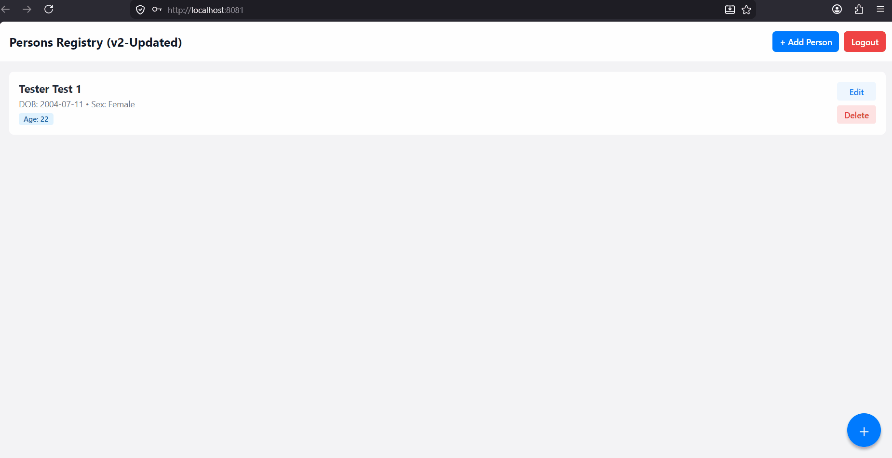

# Full-Stack Mobile & Web CRUD Application

A robust, cross-platform CRUD and authentication application built with **React Native (Expo)**, **Express.js**, and a persistent relational database. The project implements modern security architectures, dynamic platform-aware API routing (supporting Web and Android Emulators natively), and an automatic age calculation engine based on user metadata.

---

## 📱 Features & Visual Demos

This registry showcases complete operational parity between mobile emulation and standard web targets. Below are the live visual pathways demonstrating core features:

### 1. User Registration


<!-- Drag & drop your register.gif or android-register.gif to assets/ folder -->
| Web Target | Android Emulator |
| :---: | :---: |
|  |  |

---

### 2. User Authentication (Login)


| Web Target | Android Emulator |
| :---: | :---: |
|  |  |

---

### 3. Persons Registry (Full CRUD Operations)
* **Key Mechanisms**:
  * **Automated Age Calculation**: When you input a Date of Birth (YYYY-MM-DD), the application automatically computes and displays the non-clickable, exact age in real-time.
  * **Dropdown Validation**: Selecting "Sex assigned at birth" utilizes a custom, zero-dependency native modal selection window.
  * **Targeted Deletions**: Deletion requires defensive verification prompts (native `Alert.alert` on mobile, custom windows on web) to prevent accidental loss of data.

| Web Target | Android Emulator |
| :---: | :---: |
|  |  |

---

### 4. Session Termination (Logout)


| Web Target | Android Emulator |
| :---: | :---: |
|  |  |


---

## 🛠️ Project Architecture

```text
Basic_CRUD_Application/
├── assets/                  # Demo media (GIFs, PNGs)
├── backend/                 # Node.js + Express API
│   ├── src/
│   │   ├── controllers/     # Route logic controllers
│   │   ├── routes/          # Express route declarations
│   │   └── utils/           # Server-side calculation tools (e.g., ageCalc.js)
│   └── server.js            # Entry point for backend
└── src/                     # React Native + Expo Frontend
    ├── features/
    │   ├── auth/            # Context hooks and screen forms for Auth
    │   └── persons/         # List screens, custom forms, and data hooks
    └── App.js               # Application Entry Point
